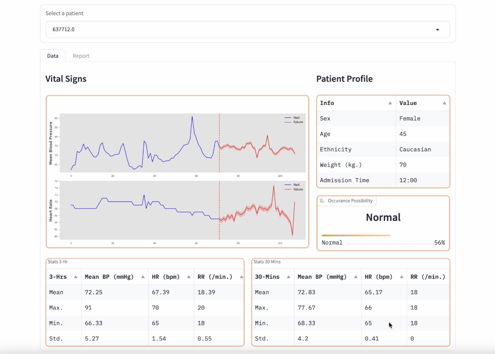
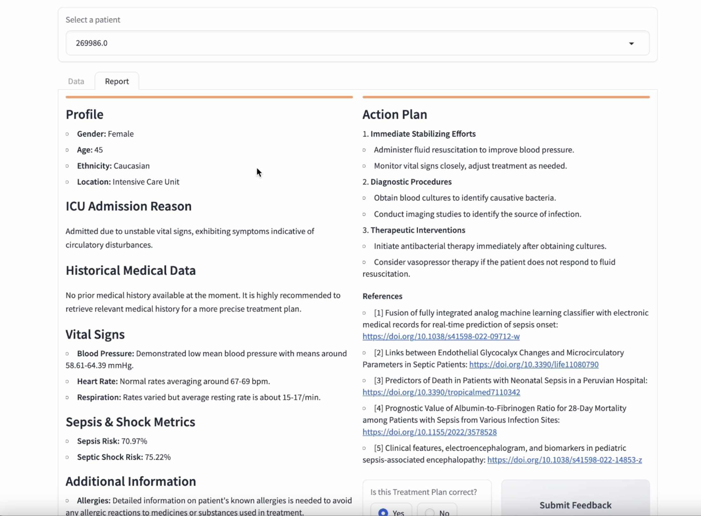

# Project Name

This is the code for sp1 project demo. 

## Table of Contents

- [Usage](#usage)

## Usage
To run the sp1 demo, here is the sample code:

```bash
# Example running commands
$ cd /Pipeline/source/
$ python /Pipeline/source/main_withllm4.py
```

## Results


